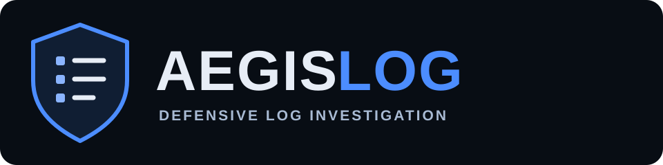

<div align="center">

# AEGISLOG



**Terminal-first defensive log investigation for analysts who want evidence, not noise.**

[](https://github.com/HR-Presents/AegisLog-AI/actions/workflows/ci.yml)
[](https://github.com/HR-Presents/AegisLog-AI/actions/workflows/security.yml)
[](https://github.com/HR-Presents/AegisLog-AI/releases/latest)
[](LICENSE)

[**Download**](https://github.com/HR-Presents/AegisLog-AI/releases/latest) · [User Guide](docs/USER_GUIDE.md) · [Commands](docs/COMMANDS.md) · [Security](SECURITY.md) · [Contributing](CONTRIBUTING.md)

`LOCAL-FIRST` &nbsp; `READ-ONLY` &nbsp; `DETERMINISTIC` &nbsp; `DEFENSIVE`

</div>

---

## A security investigation console, not another noisy scanner

AegisLog turns raw logs into structured investigation context while keeping analysis local and retained evidence visible. Its core detection and correlation pipeline is deterministic: findings are signals for analyst review, never automatic claims of compromise or attribution.

### Core capabilities

| | Capability | What it gives the analyst |
|---|---|---|
| **01** | **ANALYZE** | Parse a log, surface findings, correlate incidents, and generate summary and full retained-evidence HTML reports. |
| **02** | **LIVE MONITOR** | Watch a log source continuously with read-only detection. |
| **03** | **MULTI-SOURCE** | Correlate activity across multiple live telemetry sources. |
| **04** | **NATIVE TELEMETRY** | Inspect supported Windows, Linux, and Docker sources. |
| **05** | **NATIVE MONITOR** | Watch supported native telemetry with read-only collection. |
| **06** | **INCIDENTS** | Review evidence chains, severity, confidence, and investigation context. |
| **R** | **REPORTING** | Produce analyst-oriented HTML evidence reports that stay local. |

AI Analyst is not part of the supported public product surface. No remote model workflow, auto-remediation, exploitation, persistence, credential theft, or silent host modification is part of the supported product surface.

---

## Current release

**[v2.1.6](https://github.com/HR-Presents/AegisLog-AI/releases/tag/v2.1.6)** is the published stable release, built from `e7af0798c731720690f298c093deec74f42fa56a`.

Download the [Windows ZIP](https://github.com/HR-Presents/AegisLog-AI/releases/download/v2.1.6/AegisLog-v2.1.6-Windows.zip), standalone executable, Python wheel or source package from the release page. Matching SHA-256 files are included. The Windows executable is **unsigned**; build provenance is separate from Authenticode signing.

This release includes readable light reports with dark text, grouped findings, native channel context, folder overview printing, explicit demo/timestamp limitations, and separate summary/full-evidence print actions. The D browser dashboard is removed; terminal investigation panels remain. See [release notes](docs/RELEASE_V2.1.6.md), [upgrade guidance](docs/INSTALL.md#upgrade-and-verify), and the [roadmap](docs/ROADMAP.md).

Python 3.10–3.13 are covered by CI. Python 3.14 was exercised by the owner but is not yet in that matrix. Synthetic evaluations measure regression consistency, not independently validated real-world detection effectiveness.

---

## Quick start

### Windows standalone

1. Open the [latest release](https://github.com/HR-Presents/AegisLog-AI/releases/latest).
2. Download `AegisLog.exe` and, optionally, `AegisLog.exe.sha256`.
3. Verify the checksum if required.
4. Start the console:

```powershell
.\AegisLog.exe start
```

The interactive shell uses the authoritative `aegis@console >` prompt. Windows SmartScreen or endpoint-security reputation warnings may appear because the executable is unsigned, even when the published checksum matches.

### Install a terminal command

With Python 3.10+ and pipx installed:

```bash
python -m pipx install --force "https://github.com/HR-Presents/AegisLog-AI/releases/download/v2.1.6/aegislog_ai-2.1.6-py3-none-any.whl"
aegislog start
```

This installs the published v2.1.6 wheel. If pipx is not installed, follow the one-time setup in the installation guide. Use `py` instead of `python` if that is the Python command available on your Windows installation. Choose **04 Native logs** or **05 Native monitor** to use supported system telemetry without a supplied demo file. Press **Q** to return to your existing terminal. See [installation instructions](docs/INSTALL.md) for Windows pipx setup and uninstalling.

### Python 3.10+

```bash
git clone https://github.com/HR-Presents/AegisLog-AI.git
cd AegisLog-AI
python -m venv .venv
source .venv/bin/activate   # Windows: .venv\Scripts\activate
pip install -e .
aegislog doctor
aegislog start
```

---

## Investigation workflow

```text
TELEMETRY
   |
   v
PARSE + NORMALIZE
   |
   v
DETERMINISTIC DETECTIONS
   |
   v
CORRELATION + ANOMALY CONTEXT
   |
   v
INCIDENT QUEUE
   |
   v
EVIDENCE-LED REVIEW
   |
   v
LOCAL HTML REPORT
```

A high-severity finding or confidence score means **review this evidence carefully**. It does not mean the system is definitely compromised.

---

## Common commands

```text
AegisLog.exe dashboard C:\path\to\auth.log
AegisLog.exe incidents C:\path\to\auth.log
AegisLog.exe explain C:\path\to\auth.log <incident-id>
AegisLog.exe mitre C:\path\to\auth.log

AegisLog.exe live C:\logs\auth.log --profile security
AegisLog.exe live-multi C:\logs\auth.log C:\logs\web.log --profile authentication

AegisLog.exe native-sources
AegisLog.exe native-analyze windows --channel Security
AegisLog.exe native-live journald --profile operations

AegisLog.exe doctor
AegisLog.exe --help
```

See the complete [Command Reference](docs/COMMANDS.md).

---

## Security model

AegisLog treats log-derived content as untrusted input and keeps the analyst in control.

- **Read-only host interaction** — investigation does not become remediation.
- **Deterministic local analysis** — detection behavior remains inspectable and testable.
- **Evidence before verdicts** — uncertainty and retained evidence remain visible.
- **No installation telemetry** — the project does not add tracking simply to count users.
- **Safe public collaboration** — issues and reviews should use sanitized or synthetic data.

Read [Security](SECURITY.md), [Threat Model](docs/THREAT_MODEL.md), [Privacy](docs/PRIVACY.md), and [No Auto-Remediation](docs/NO_AUTOREMEDIATION.md).

---

## Documentation

| Start here | Engineering / reference |
|---|---|
| [Installation](docs/INSTALL.md) | [Architecture](docs/ARCHITECTURE.md) |
| [Quick Start](docs/QUICKSTART.md) | [Detection Pipeline](docs/DETECTION_PIPELINE.md) |
| [User Guide](docs/USER_GUIDE.md) | [Parsers](docs/PARSERS.md) |
| [Commands](docs/COMMANDS.md) | [Rules](docs/RULES.md) |
| [Demo](docs/DEMO.md) | [Collectors](docs/COLLECTORS.md) |
| [Troubleshooting](docs/TROUBLESHOOTING.md) | [Testing](docs/TESTING.md) |
| [FAQ](docs/FAQ.md) | [Performance](docs/PERFORMANCE.md) |
| [Documentation Index](docs/README.md) | [Limitations](docs/LIMITATIONS.md) |

---

## Contributing

```bash
python -m venv .venv
source .venv/bin/activate
pip install -e '.[dev]'
pytest
ruff check .
bandit -q -r src
```

Keep pull requests focused, add tests for behavioral changes, and never commit credentials, customer information, or sensitive production logs.

---

## License

AegisLog is released under the [MIT License](LICENSE).

<div align="center">

**AEGISLOG** · Investigate locally. Preserve evidence. Keep the analyst in control.

</div>

### Scan a folder of logs

In `aegislog start`, choose **F Scan Folder** and enter a folder path. A bounded recursive scan finds nonempty text candidates (`.log`, `.txt`, `.jsonl`, `.ndjson`, `.json`, `.csv`), skips symlinks and binary files, and lets you select numbers or ALL. Each selected source receives its own summary and evidence report under `aegislog-reports/folder-scan/`; **R Reports** opens them. Sources remain unchanged. Extension matching does not guarantee parser support. Discovery stops at 200 candidates or 10,000 entries; choose a smaller folder to cover the rest. B returns and Q quits.

### Guided computer checks

Choose **C Check Computer** for readable-source discovery and a bounded native-log investigation, or run `aegislog check-computer`. Native logs use the selected time window; discovered files use their full contents. All investigations run in the terminal and create local HTML reports. Sources are handled read-only.

Folder scans now default to likely logs, offer identical-content deduplication, preserve relative source locations, and produce a searchable batch overview plus JSON manifest. B/Escape/Ctrl+C cancels while retaining completed reports. **O** opens completed reports and **F** opens their folder. **R** paginates all saved summaries and batch overviews; the terminal keeps **C/F/R/A** shortcuts visible beneath the scrollable home. Physical lines, records and recognized records are reported separately. Supported structured inputs and detection limits are listed in [compatibility](docs/COMPATIBILITY.md).

## Reports and product previews

Reports provide a short summary and a separate full retained-evidence HTML document. Use **Print complete report / Save PDF** for the complete report, or **Print summary / Save PDF** for the short overview. Disable browser **Headers and footers** to remove browser-added local file paths. Preserve original logs separately.

For the built-in synthetic authentication demo, the summary reports **7 records, 2 findings (HIGH authentication lead and MEDIUM operational error), and 2 incident groups**. These are training signals, not findings about the user's computer. Yearless syslog timestamps are not guessed; event-order correlation does not establish elapsed time.

Existing terminal images below are **development reference/QA previews**, not screenshots of the v2.1.6 Windows executable. See [capture provenance](docs/assets/screenshots/README.md).


## Feedback and next steps

[Report a bug](https://github.com/HR-Presents/AegisLog-AI/issues/new?template=bug_report.md), [request a feature](https://github.com/HR-Presents/AegisLog-AI/issues/new?template=feature_request.md), or review the [roadmap](docs/ROADMAP.md). Include a sanitized reproducible example and your version; report vulnerabilities privately through [SECURITY.md](SECURITY.md).
