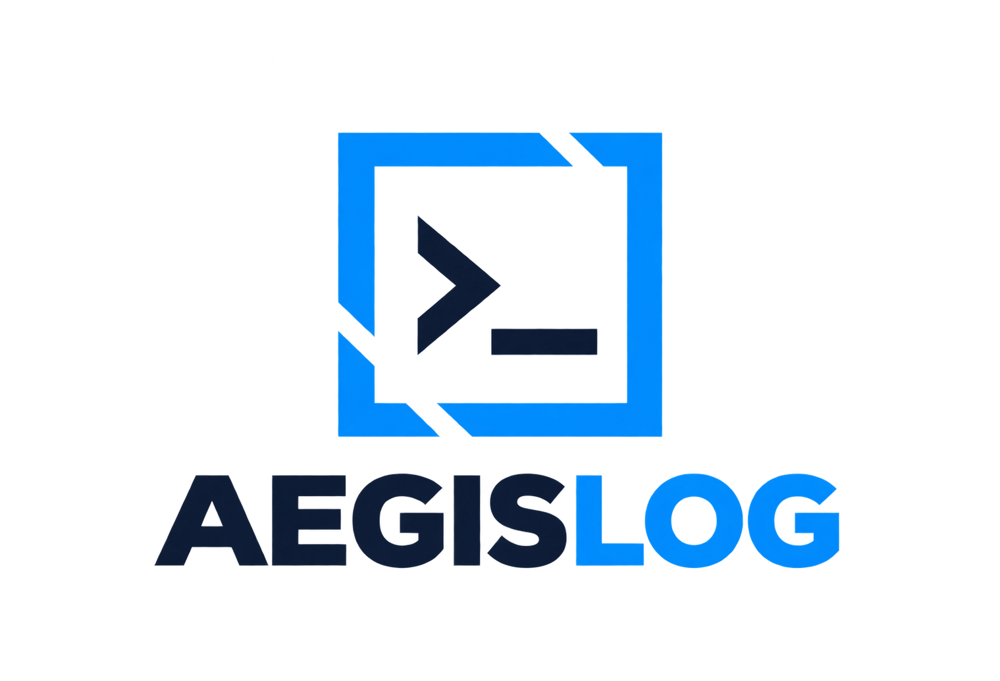
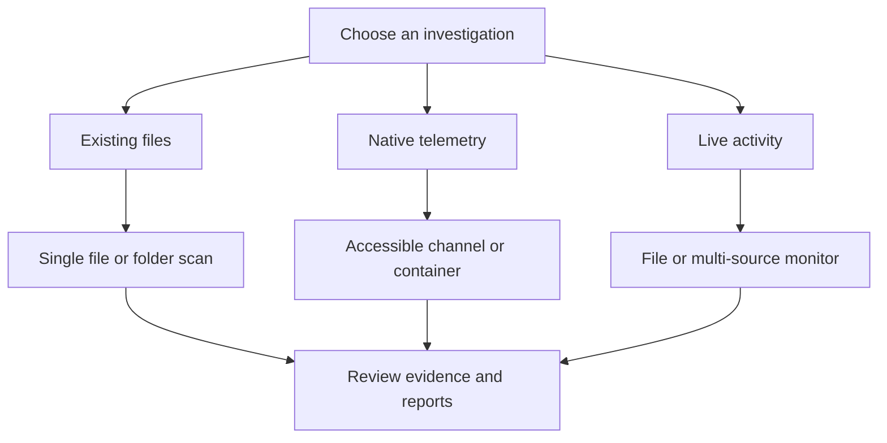
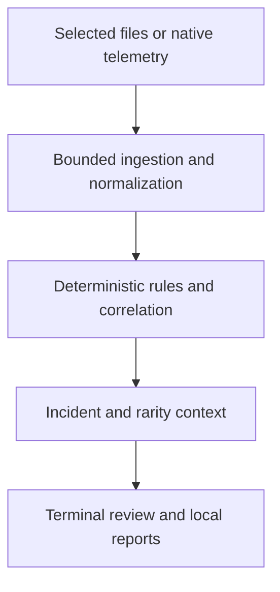
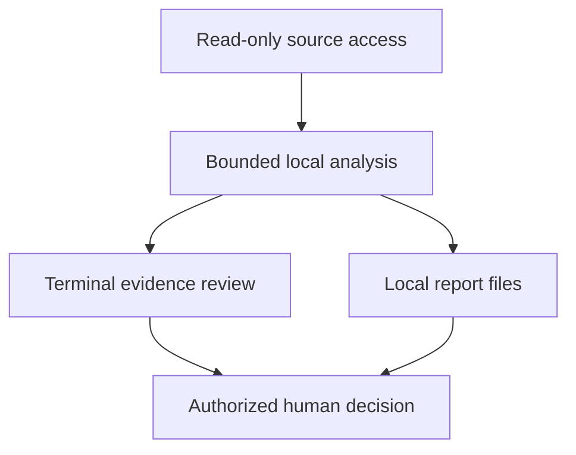
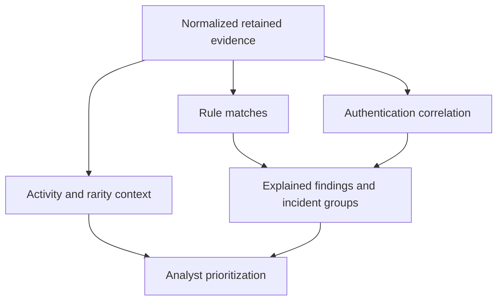
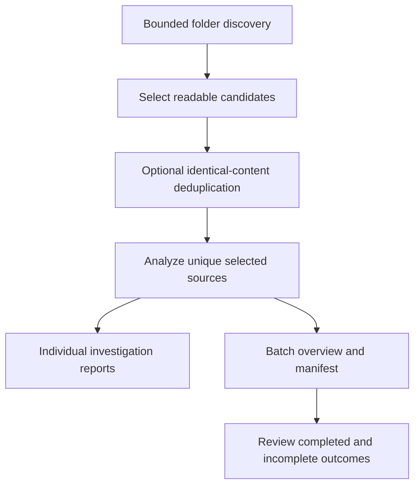
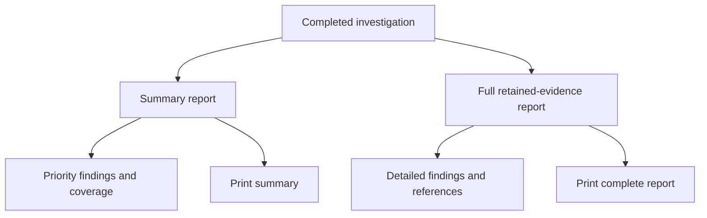

<div align="center">

<picture>
  <source media="(prefers-color-scheme: dark)" srcset="docs/assets/aegislog-readme-dark.png">
  
</picture>

# AegisLog

**Defensive Log Investigation & Evidence Analysis Platform**

**LOCAL-FIRST · READ-ONLY · DETERMINISTIC · EVIDENCE-DRIVEN · EXPLAINABLE**

[](https://github.com/HR-Presents/AegisLog-AI/actions/workflows/ci.yml)
[](https://github.com/HR-Presents/AegisLog-AI/actions/workflows/security.yml)
[](https://github.com/HR-Presents/AegisLog-AI/releases/latest)
[](LICENSE)

[Overview](#overview) · [Architecture](#platform-architecture) · [Detection](#detection-and-analysis) · [Monitoring](#live-monitoring) · [Reports](#reports-and-evidence) · [Installation](#installation) · [Security](#security-and-responsible-use)

**MADE BY HR-PRESENTS**

</div>

> [!IMPORTANT]
> **Read-only investigation boundary**
>
> AegisLog reads selected logs and accessible native telemetry, analyzes them locally, and writes investigation reports and requested local state. It does not change source logs, accounts, services, firewall rules, or host security settings. Findings support human investigation; they do not authorize remediation.

## Start here

New to log investigation? Follow the [five-step beginner guide](docs/QUICKSTART.md), then try the [downloadable synthetic demo pack](https://github.com/HR-Presents/AegisLog-AI/raw/refs/heads/main/docs/demo/AegisLog-First-Investigation-Demo.zip). The pack includes checked expected results and a no-matching-findings comparison fixture.

**Who it helps:** IT administrators investigating service problems, support engineers reviewing application logs, and security analysts triaging accessible local evidence. AegisLog provides local investigation and reporting; a managed SIEM, EDR, fleet agent or automated remediation service requires other tooling.

| Input | What AegisLog handles | Coverage limit |
| --- | --- | --- |
| Text logs | Syslog, ISO service records, common web access logs and Windows collector text | Unknown text may use generic fallback rules |
| Structured records | Known JSON/JSONL message, Docker, ECS, Suricata EVE, Zeek connection and network-flow fields; corresponding CSV schemas | Arbitrary JSON/CSV is not universally understood; recognized parsing does not imply a detection rule |
| Native telemetry | Windows System/Application/Security, Linux journald, Docker logs where available | OS, permissions, source availability, time window and event caps apply |
| Folders | Discover supported readable text candidates, then analyze selected files separately | Bounded discovery; binary/EVTX, compressed and unsupported encodings require appropriate export/conversion |

Check the report's recognized-record counts, retained evidence and collection limits. No matching rules does not establish a clean system. Rarity scores describe the sample, not attack probability.

[First-user feedback checklist](docs/FIRST_USER_CHECKLIST.md) · [Launch announcement draft](docs/LAUNCH_ANNOUNCEMENT.md)

## Overview

AegisLog is a terminal-first defensive log investigation platform for local files, native telemetry, and live log streams.

It combines bounded ingestion, format recognition, deterministic rules, authentication correlation, incident grouping, rarity context, evidence review, and local HTML reporting. Users can investigate one file, scan a folder, inspect accessible computer logs, or monitor supported sources from their existing terminal.

The supported file workflow recognizes selected layouts in:

- Syslog and application/service text logs.
- Common web access logs.
- JSON, JSONL and NDJSON message records.
- Header-based CSV, including recognized network-flow fields.
- Zeek connection records and Suricata EVE evidence.

Native collectors support Windows Event Logs, Linux journald, and Docker logs where the required tools and access are available. Format-specific coverage and fallback behavior are described in [Compatibility](docs/COMPATIBILITY.md).

> [!NOTE]
> **Evidence-driven by design**
>
> Findings come from supplied files or explicitly selected telemetry sources. Bundled demonstrations are synthetic. Recognizing a record format does not guarantee that every relevant threat has a matching detection rule.

### What AegisLog Does

AegisLog helps answer four practical questions: what happened in the available logs, which records deserve attention, how the retained evidence relates, and what to inspect next. It supports security investigation and everyday operational troubleshooting from the same terminal.

A user can begin with an existing application log, inspect accessible operating-system events without preparing a file, scan a folder of logs, or watch new events arrive. The result is an evidence-based investigation with readable local reports and explicit coverage limits.

### Choose an Investigation



## Platform Architecture

The investigation pipeline keeps evidence collection, analysis, and presentation separate.



Source sizes, retained excerpts, truncation, and collection limits affect the evidence available for analysis. Reports disclose these limits rather than presenting a bounded sample as a complete history.

### Collection and Trust Boundaries



AegisLog reads from selected sources and writes its own reports or requested investigation state. The analysis pipeline provides no automatic source-editing or host-remediation action.

### Evidence-to-Decision Workflow

1. Select a file, folder, native source, or live monitor.
2. Review physical-line, record, recognized-format, and retention counts.
3. Inspect findings, incident groups, evidence, and investigation guidance.
4. Open the summary or full retained-evidence report.
5. Validate the lead against surrounding telemetry before taking action.

> [!TIP]
> **How to interpret a result**
>
> Severity, confidence, incident grouping, and rarity help prioritize review. They do not independently prove an attack, attribution, or a shared root cause.

## Core capabilities

| Area | AegisLog |
|---|---|
| File investigation | Static analysis of supported log layouts with disclosed parsing coverage |
| Native telemetry | Windows System/Application/Security, Linux journald, and Docker collectors |
| Guided computer checks | Discover accessible sources and select a bounded native time window |
| Folder investigation | Bounded recursive discovery, source selection, optional identical-content deduplication |
| Deterministic detection | Local rules and authentication-related correlation |
| Incident context | Grouped evidence, explanations, entities, and ATT&CK review context |
| Anomaly context | Event-class rarity within retained evidence |
| Live monitoring | Read-only rolling file and native-source views |
| Multi-source monitoring | Compare and correlate supported live sources |
| Security Workbench | Evidence filtering, details, timeline, and supported exports |
| Reports | Light HTML reports with dark text, summaries, and full retained evidence |
| Batch reporting | Searchable folder overview, source outcomes, and JSON manifest |
| Navigation | Back, Quit, report opening, and return to the existing terminal |
| Health checks | Runtime, configuration, detection engine, and collector availability |

## Detection and Analysis

### Deterministic Rules

The local engine checks recognized evidence and supported text patterns for investigation leads, including authentication failures, privileged activity, web-related signals, and operational errors. Findings retain evidence and explanation so an analyst can inspect why they appeared.

Operational errors are distinguished from security investigation leads. A service timeout may need troubleshooting without establishing malicious activity.

### Authentication and Privilege Context

Authentication correlation can group related failures into an investigation lead. Windows event identity and account context affect interpretation: event 4672 for exact built-in service SIDs is treated as informational baseline activity, while other privileged logons may warrant review.

> [!NOTE]
> **Context changes interpretation**
>
> A Windows privilege event is not automatically an attack. Confirm the account, session, surrounding events, and expected administrative activity.

### Incident Correlation

Incident groups connect related retained evidence for investigation. Grouping does not establish a common cause, malicious intent, or confirmed compromise. Explanations and ATT&CK context remain review aids.

### Rarity and Activity

Terminal activity charts show bounded retained timestamped evidence. Report timelines show up to 12 occupied UTC minute buckets, disclose skipped gaps and unresolved timestamps, and avoid inventing missing time information. Rarity scores describe unusual event classes within the retained sample; they are not a trained attack classifier.

> [!WARNING]
> **Unusual activity is a lead, not a verdict**
>
> A rare event may be benign. Zero findings may reflect limited rules, unsupported fields, missing evidence, or collection limits. It does not establish a clean system.

### How Findings Gain Context



Rule matches identify supported conditions. Correlation adds relationships, while activity and rarity describe the available sample. The analyst reviews these signals together with coverage and source context.

## Native Logs and Computer Checks

Choose **C Check Computer** to discover readable sources, then select a source and time window. Native snapshots are bounded by both time and count; known file sources are analyzed as files rather than through that native time window.

| Source | Requirements and scope |
|---|---|
| Windows Event Logs | Read access to the selected System, Application, or Security channel |
| Linux journald | `journalctl` and permission to read the requested journal |
| Docker | Docker CLI, running engine, and access to the named container |
| Known system/application paths | Existing readable log files; discovery is not exhaustive |

Windows Security channel access may require an administrator terminal. Use elevation only when you need a protected source. Docker is optional for ordinary file and Windows Event Log investigations.

## Folder Investigation

Choose **F Scan Folder** and enter a folder path. Discovery defaults to likely logs; other supported text candidates can be included explicitly. Select sources individually or use ALL.

The workflow:

- Performs bounded recursive discovery and skips symlinks and binary files.
- Offers identical SHA-256 content deduplication while preserving relative source paths.
- Analyzes selected sources separately.
- Records completed, duplicate, failed, cancelled, and pending outcomes.
- Generates a searchable batch overview, individual reports, and a JSON manifest.
- Retains completed reports when a scan is cancelled.

Discovery stops at 200 candidates or 10,000 entries. Choose a smaller folder when those limits prevent complete discovery. Matching a file extension does not guarantee complete parser support.

### Folder-to-Report Workflow



Relative source paths remain visible even when identical content shares a report. Failed, cancelled, or pending items remain distinct from successfully analyzed evidence.

## Live Monitoring

**02 Live Monitor** watches appended file events. **03 Multi-Source** compares supported live sources. **05 Native Monitor** watches supported native telemetry.

Live views use bounded rolling evidence. They do not create a complete historical archive and do not replace a centralized SIEM or endpoint agent. Security Workbench and live monitors retain their documented line-oriented detection scope rather than universal structured-schema import.

Use **B/Escape** to stop a live view and **Q** to quit AegisLog. Quitting returns control to the terminal where it was started.

## Reports and Evidence

Reports use white document pages, black text and light sea-blue framing. Aligned metrics, boxed findings and side rules separate observed context, recommended review and retained evidence. The summary links to the full investigation record; every retained detector excerpt keeps its evidence reference. Full-report page count grows with evidence. Supporting activity distributions and rarity context can be expanded in the browser and are omitted from the compact print layout with an explicit notice.


Each investigation provides a short summary and a separate full retained-evidence HTML report. Reports use a company-facing layout with a larger transparent AegisLog logo, black body text, light sea-blue accents, a compact metrics strip, specific issue labels, and separate evidence and recommended-review areas. The short summary puts priority findings before supporting activity and collection scope; raw structured evidence stays in the complete report. The full report uses four investigation navigation choices, avoids repeated rule labels, and puts source identity and processing statistics in a technical appendix. The closing signature reads **MADE BY HR-PRESENTS**. Distribution bars include observed counts; timelines appear only when the retained timestamps support them.

| Report | Purpose |
|---|---|
| Investigation summary | Compact overview, priority findings, coverage, and next steps |
| Full retained-evidence report | Detailed retained findings and supporting references |
| Folder overview | Batch outcomes, per-source context, search, and source appendix |
| JSON exports/manifest | Supported machine-readable investigation and batch context |

Use **R Reports** from the terminal to browse saved summaries and batch overviews. Completed workflows provide report/folder opening actions where supported.

Expanded supporting distributions align Categories, Log levels, and Services side by side on wide screens. Narrow screens stack these panels; the compact print layout omits optional supporting panels with an explicit notice.

### Report Navigation



### Printing and PDF

Use **Print summary / Save PDF** for the overview or **Print complete report / Save PDF** for the full retained-evidence document. Disable browser **Headers and footers** to remove browser-added dates and local file URLs.

> [!IMPORTANT]
> **A report preserves retained analysis, not every original event**
>
> Keep original logs separately. Retention limits and omitted or truncated evidence are disclosed. A PDF summary is not a substitute for the full report or the original source.

## Installation

### Current Release

The investigation improvements are documented in [Investigation workflows](docs/INVESTIGATION_WORKFLOWS.md): grouped triage, explicit Windows session context, Docker/ECS message adapters, searchable saved cases, collection progress, signal comparisons, export preview, runtime diagnostics and opt-in release checks. These changes, the approved boxed report design and the repository audit fixes are included in the v2.1.16 Windows and Python downloads. Source/output collision checks, consistent incident IDs, custom-rule report inclusion and bounded ingestion improve investigation reliability.

The latest release also preserves native collection scope in both reports, improves summary pagination and explains explicit shadow-copy storage-limit observations.

Recent reliability fixes preserve target-group evidence boundaries, redact credential-key variants, handle live path rotation and enforce baseline scope matching. Windows detection quality includes explicit group-SID classification, target-host correlation boundaries and clearer heuristic scores. See [Detection coverage](docs/DETECTION_COVERAGE.md).

The merged final-audit safeguards are being prepared for v2.1.17; [candidate release notes](docs/RELEASE_V2.1.17.md) describe the custom-rule compatibility changes. The stable links below remain v2.1.16 until the new assets are verified and published.

**[v2.1.16](https://github.com/HR-Presents/AegisLog-AI/releases/tag/v2.1.16)** is the published stable release, built from `f511c971ca19bfb3560a65c1f3681ff3a9b1ace5`.

Download the [Windows ZIP](https://github.com/HR-Presents/AegisLog-AI/releases/download/v2.1.16/AegisLog-v2.1.16-Windows.zip), standalone executable, Python wheel, or source package from the release page. Matching SHA-256 files are included.

> [!NOTE]
> **Windows signing status**
>
> The Windows executable is unsigned. SmartScreen or endpoint-security reputation warnings may appear. Verify the published checksum; build provenance is separate from Authenticode signing.

The release also bounds baseline reads to 2 MB and validates isolated Windows wheel installations on Python 3.10 and 3.14. See the [remaining validation handoff](docs/VALIDATION_HANDOFF.md) for owner-controlled branch protection, independently labeled real-world evaluation and physical-PC acceptance checks.

### Windows Standalone

Download `AegisLog.exe` from the release page, then run from its folder:

```powershell
.\AegisLog.exe --version
.\AegisLog.exe doctor
.\AegisLog.exe start
```

Extract the Windows ZIP before using its packaged files.

### Install a Terminal Command

With Python 3.10+ available, install pipx once:

```bash
python -m pip install --user pipx
python -m pipx ensurepath
```

Close and reopen your terminal so PATH changes take effect. Then install the published wheel:

```bash
python -m pipx install --force "https://github.com/HR-Presents/AegisLog-AI/releases/download/v2.1.16/aegislog_ai-2.1.16-py3-none-any.whl"
aegislog --version
aegislog doctor
aegislog start
```

Use `py` instead of `python` if that is the Python command available on your Windows installation.

> [!TIP]
> **Command not recognized?**
>
> Reopen the terminal after `ensurepath`. In Windows Command Prompt, you can also run `"%USERPROFILE%\.local\bin\aegislog.exe" start` directly. See [Installation](docs/INSTALL.md) for PowerShell, upgrades, and uninstalling. Avoid combining pipx `--force` with `--pip-args="--force-reinstall"`.

### Development Installation

```bash
git clone https://github.com/HR-Presents/AegisLog-AI.git
cd AegisLog-AI
python -m venv .venv
source .venv/bin/activate   # Windows CMD: .venv\Scripts\activate
pip install -e '.[dev]'
aegislog doctor
aegislog start
```

This installs the checked-out source rather than the immutable published wheel. See [upgrade guidance](docs/INSTALL.md#upgrade-and-verify) before changing an existing installation.

## How to Use AegisLog

At `aegis@console >`, select a workflow or type a supported command.

| Choice | Workflow |
|---|---|
| 01 | **ANALYZE** a log file or the built-in demo |
| 02 / 03 | **LIVE MONITOR** / multi-source monitoring |
| 04 / 05 | Native snapshot / native monitoring |
| 06 | **INCIDENTS**: review incident evidence |
| 07 / P | Demo / recorded replay |
| 08 / 09 | Health / command help |
| C / F | Guided computer check / folder scan |
| S | Security Workbench |
| R / A | Saved reports / workflow explanation |
| G | Optional beginner walkthrough with synthetic demo |
| B / Q | Back / Quit |

Choose G Beginner for the optional guided synthetic investigation and first-report walkthrough.

The D browser dashboard is removed. Terminal investigation panels remain; the CLI `dashboard` command renders a terminal investigation.

### Common Commands

```bash
aegislog dashboard "C:\logs\auth.log"
aegislog incidents "C:\logs\auth.log"
aegislog explain "C:\logs\auth.log" <incident-id>
aegislog mitre "C:\logs\auth.log"
aegislog live "C:\logs\auth.log" --profile security
aegislog live-multi "C:\logs\auth.log" "C:\logs\web.log" --profile authentication
aegislog native-sources
aegislog native-analyze windows --channel Security
aegislog native-live journald --profile operations
aegislog check-computer
aegislog --help
```

Replace example paths with your own accessible files. See the complete [Command Reference](docs/COMMANDS.md).

## Demonstration Data

Start `aegislog start`, choose **01 Analyze**, and enter `demo`, or choose **07 Demo** for the quick-start workflow.

The built-in authentication demo contains **7 records, 2 findings, and 2 incident groups**: a HIGH authentication investigation lead and a MEDIUM operational error. These are synthetic training signals, not findings about the user's computer. Yearless syslog timestamps are not guessed; event order alone does not establish elapsed time.


## Technology Stack

| Layer | Technology |
|---|---|
| Runtime | Python 3.10+ |
| Command interface | Typer |
| Terminal presentation | Rich |
| Analysis | Local Python parsers, rules, correlation, and bounded state |
| Reports | Local HTML, CSS, and JavaScript |
| Optional investigation storage | SQLite |
| Windows packaging | Standalone executable release workflow |
| Testing and linting | pytest and Ruff |
| Security checks | Bandit and dependency auditing |

## Repository Structure

| Location | Purpose |
|---|---|
| `src/aegislog/` | CLI, parsing, detection, collectors, investigation, and reporting |
| `tests/` | Automated regression and behavior checks |
| `docs/` | User guides, architecture, compatibility, security, and release guidance |
| `docs/assets/` | Logo and documented reference previews |
| `evaluation/` | Synthetic labeled regression evidence |
| `.github/workflows/` | CI, security, packaging, and release workflows |
| `pyproject.toml` | Python package metadata and tool configuration |
| `SECURITY.md` | Security reporting policy |
| `CHANGELOG.md` | Release history |

## Automated Tests

With development dependencies installed:

```bash
python -m pytest -q
ruff check .
bandit -q -r src
```

Python 3.10–3.13 are covered by CI. Python 3.14 was exercised by the owner but is not yet in that matrix.

> [!NOTE]
> **Tests validate implementation behavior**
>
> Synthetic evaluations measure regression consistency. Passing tests do not establish independently validated real-world precision, recall, or universal detection coverage.

## Security and Responsible Use

AegisLog treats log-derived content as untrusted input. Normal presentation uses terminal sanitization, HTML escaping, and best-effort common-secret redaction. Bounded ingestion limits retained evidence and oversized input handling.

Analyze only sources you are authorized to access. Sanitize examples before sharing reports or filing public issues; redaction does not guarantee that every sensitive value has been removed. Install only trusted custom regex packs, which are local configuration rather than an execution-time sandbox.

Custom rule safeguards: packs are limited to 1 MB, 32 files, 100 rules per pack and 200 rules total. Patterns retain literals, anchors, character classes, dot tokens and alternatives; groups, repetition, lookarounds and backreferences are rejected before execution to avoid backtracking stalls. Escaped metacharacters remain literal. Invalid packs are reported and skipped atomically. Existing packs using unsupported constructs must be rewritten; `--no-plugins` disables custom rules. These restrictions do not affect built-in detectors.

The supported public product uses deterministic local analysis. AI Analyst and remote model workflows are not part of the supported public product surface. There is no automatic remediation or host-control workflow.

Read [Security](SECURITY.md), [Threat Model](docs/THREAT_MODEL.md), [Privacy](docs/PRIVACY.md), and [No Auto-Remediation](docs/NO_AUTOREMEDIATION.md). Report vulnerabilities through the private route described in the security policy.

## Important Limitations

- Arbitrary JSON/CSV schemas are not universally understood; unsupported structures may receive generic text analysis.
- EVTX files, compressed archives, UTF-16, and binary data are not supported by the guided file workflow. Export readable UTF-8 evidence first.
- Native time windows, count caps, access permissions, and retained-sample limits constrain coverage.
- Folder sources are analyzed separately; a batch overview is not automatic cross-file historical correlation.
- Live monitoring and Security Workbench have their own documented line-oriented scope.
- Yearless or missing timestamps require context; AegisLog does not invent missing time information.
- Rarity scores and ATT&CK mappings are investigation aids, not proof of compromise.
- The Windows executable remains unsigned; macOS has no native collector.

See [Compatibility](docs/COMPATIBILITY.md), [Limitations](docs/LIMITATIONS.md), and the [Roadmap](docs/ROADMAP.md) for released scope and planned work.

## Documentation

| Document | Purpose |
|---|---|
| [Installation](docs/INSTALL.md) | Standalone, pipx, upgrades, and verification |
| [User Guide](docs/USER_GUIDE.md) | Investigation workflows |
| [Reports](docs/REPORTS.md) | Reading, printing, coverage, and report design |
| [Commands](docs/COMMANDS.md) | CLI reference |
| [Demo](docs/DEMO.md) | Synthetic demonstration workflows |
| [Architecture](docs/ARCHITECTURE.md) | Pipeline and trust boundaries |
| [Detection Pipeline](docs/DETECTION_PIPELINE.md) | Detection behavior |
| [Compatibility](docs/COMPATIBILITY.md) | Formats and coverage limits |
| [Troubleshooting](docs/TROUBLESHOOTING.md) | Installation and runtime issues |
| [Testing](docs/TESTING.md) | Validation guidance |
| [Release Notes](docs/RELEASE_V2.1.16.md) | Published v2.1.16 changes |
| [Roadmap](docs/ROADMAP.md) | Released capabilities and future priorities |
| [Documentation Index](docs/README.md) | Complete documentation directory |

## Design Principles

| Principle | What it means |
|---|---|
| Defensive | Investigate evidence and support review |
| Local-first | Keep supported analysis and reporting local |
| Read-only | Preserve source logs and host configuration |
| Deterministic | Make detection behavior inspectable and testable |
| Explainable | Retain reasons, evidence, context, and limitations |
| Human-directed | Leave operational decisions with authorized people |

## Contributing and Feedback

Read [Contributing](CONTRIBUTING.md) and the [Code of Conduct](CODE_OF_CONDUCT.md). Keep changes focused and include relevant validation.

[Report a bug](https://github.com/HR-Presents/AegisLog-AI/issues/new?template=bug_report.md) or [request a feature](https://github.com/HR-Presents/AegisLog-AI/issues/new?template=feature_request.md). Include your version and a sanitized reproducible example. Never commit credentials, customer information, or sensitive production logs.

## License

AegisLog is released under the [MIT License](LICENSE).

<div align="center">

<picture>
  <source media="(prefers-color-scheme: dark)" srcset="docs/assets/aegislog-readme-dark.png">
  
</picture>

**AegisLog**

**LOCAL-FIRST · READ-ONLY · DETERMINISTIC · EVIDENCE-DRIVEN · EXPLAINABLE**

Defensive Log Investigation · Native Telemetry · Monitoring · Evidence Reports

**MADE BY HR-PRESENTS**

</div>
